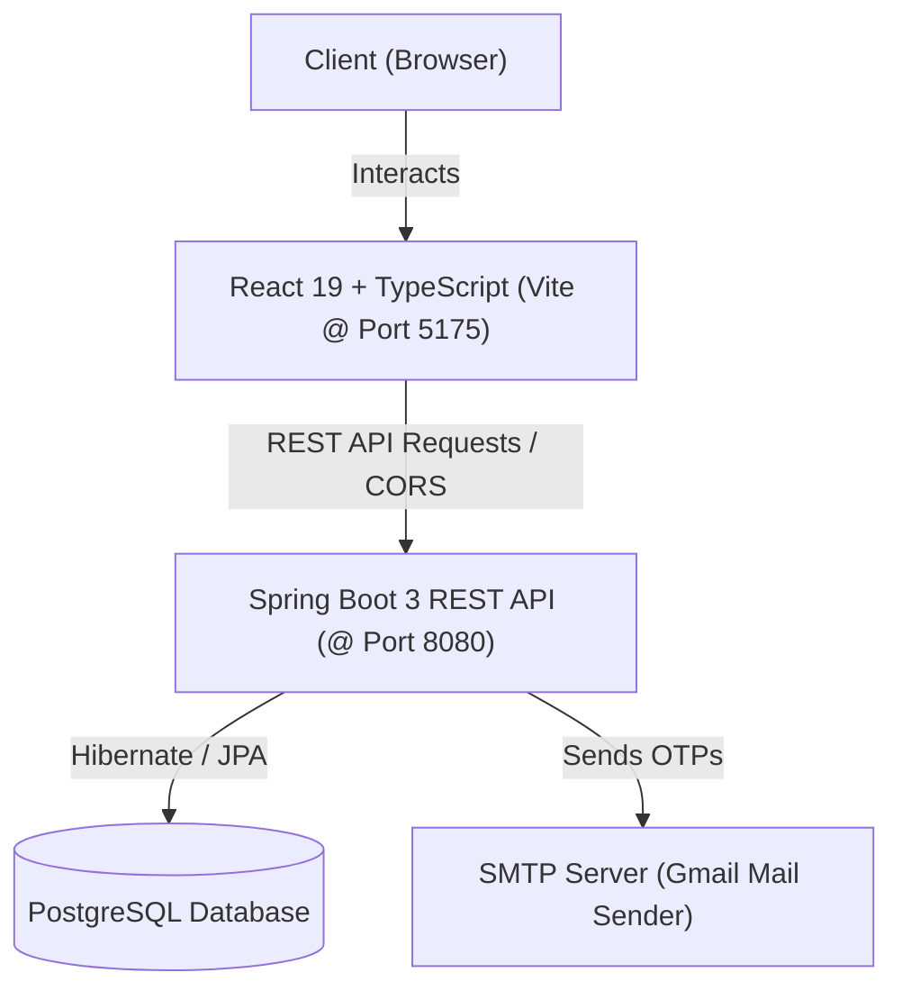

# EcoCare 🌱🔋

> **Next-Generation EV Battery Health Diagnostics, Lifecycle Management & Smart Charging Ecosystem**

[](https://react.dev/)
[](https://spring.io/projects/spring-boot)
[](https://www.postgresql.org/)
[](LICENSE)

---

## 📖 Overview

**EcoCare** is an end-to-end electric vehicle (EV) intelligence platform built to monitor battery state-of-health, extend battery lifecycle through secondary marketplaces, and streamline EV mobility with live charging station navigation and enterprise OEM management.

From individual EV owners monitoring pack degradation to OEM fleet managers analyzing city-wide performance metrics, EcoCare provides real-time telemetry, predictive analytics, and actionable insights.

---

## ✨ Key Features

### 🔋 1. Battery Health & AI Diagnostics Terminal
- **State-of-Health (SoH) & State-of-Charge (SoC)** tracking with live status indicators.
- **Deep Metrics Analysis**: Internal resistance, temperature variations, charging cycles, cell voltage balance, and degradation rate.
- **Remaining Useful Life (RUL) Prediction**: Predictive algorithms calculating expected cycle life and replacement timelines.
- **Diagnostic Trouble Codes (DTC)** & automated issue detection with severity ratings.

### ⚡ 2. Smart EV Charging Station Finder
- **Interactive Map** powered by Leaflet with custom geolocation markers.
- **Live Port Availability**: Real-time tracking of total, occupied, and available ports.
- **Charger Specifications**: Support for CCS2 DC Fast Chargers (up to 150 kW), AC Type 2, and Bharat EV specifications.
- **Proximity Search**: Haversine distance calculations finding stations nearest to user coordinates with radius filtering.

### 📜 3. Digital Battery Passport & Verification
- **Battery Passports**: Tamper-proof digital passports tracking battery chemistry (LFP, NMC), manufacturing pedigree, and ownership history.
- **QR Code & Verification Links**: Instant diagnostic verification for buyers, insurers, and technicians.
- **Valuation Estimation**: Transparent fair-market valuation derived from remaining health scores.

### 🔄 4. Second-Life Battery Marketplace
- **Battery Repurposing**: Facilitates the resale of retired automotive batteries for stationary energy storage (ESS), solar backup, and micro-grids.
- **Certified Listings**: Battery packs cataloged with verified health certificates, cycle counts, and warranty options.

### 🏢 5. OEM & Enterprise Fleet Management
- **Dealership & Service Center Network**: Centralized directory and locator for authorized EV touchpoints.
- **City-Wide Sales Analytics**: Visual sales trends, model adoption rates, and regional breakdown.
- **Complaint & Service Workflow**: Ticket management system with diagnostic report attachments and status progression.
- **Showroom Vehicle Inventory**: Real-time tracking of showroom demo units, specs, and status.

### 🔐 6. Secure Authentication & Role Management
- **Email OTP Verification**: 6-digit one-time password verification via Spring Mail SMTP.
- **Role-Based Access Control (RBAC)**: Tailored workflows for EV Owners, Technicians, and OEM Administrators.
- **BCrypt Encryption**: Secure credential storage and session handling.

---

## 🛠️ Architecture & Tech Stack



### Frontend
- **Framework**: [React 19](https://react.dev/) + [TypeScript](https://www.typescriptlang.org/)
- **Bundler & Tooling**: [Vite](https://vitejs.dev/), [Oxlint](https://oxc.rs/)
- **Styling**: Tailwind CSS & Modern Glassmorphism UI
- **Visualizations**: [Recharts](https://recharts.org/) for real-time telemetry graphs
- **Mapping**: [Leaflet](https://leafletjs.com/) with React-Leaflet
- **Icons**: [Lucide React](https://lucide.dev/)

### Backend
- **Framework**: [Spring Boot 3.3.2](https://spring.io/projects/spring-boot) (Java 21)
- **Data & Persistence**: Spring Data JPA, Hibernate ORM
- **Service Discovery**: Spring Cloud Netflix Eureka Client ready
- **Security & Mail**: BCrypt password hashing, Spring Boot Starter Mail (SMTP)
- **Database**: [PostgreSQL](https://www.postgresql.org/)

---

## 📁 Repository Structure

```
EcoCare/
├── backend/                             # Spring Boot 3 Java Backend
│   ├── src/
│   │   ├── main/
│   │   │   ├── java/com/example/evbatteryhealth/
│   │   │   │   ├── controller/          # REST API Controllers (Auth, Battery, Charging, etc.)
│   │   │   │   ├── model/               # JPA Entities (BatteryAnalysis, User, Station, etc.)
│   │   │   │   ├── repository/          # Spring Data Repositories
│   │   │   │   ├── service/             # Business Logic & Seeders
│   │   │   │   └── util/                # Utilities (PasswordEncoder, etc.)
│   │   │   └── resources/
│   │   │       └── application.properties # App configuration & DB connection
│   │   └── test/                        # Unit and integration tests
│   └── pom.xml                          # Maven build configuration
│
├── frontend/                            # React + TypeScript + Vite Frontend
│   ├── public/                          # Static assets, branding, and video clips
│   ├── src/
│   │   ├── assets/                      # UI images and icons
│   │   ├── components/                  # Modals and specialized views
│   │   ├── services/                    # API service layers
│   │   ├── types/                       # TypeScript interfaces and contracts
│   │   ├── App.tsx                      # Main application view & router state
│   │   └── main.tsx                     # React entrypoint
│   ├── package.json                     # Frontend dependencies & scripts
│   └── vite.config.ts                   # Vite configuration (port 5175)
│
└── .gitignore                           # Git ignore rules for node_modules, build targets, etc.
```

---

## 🚀 Getting Started

### Prerequisites

Ensure you have installed:
- **Java JDK 21+** (`java -version`)
- **Apache Maven 3.8+** (`mvn -v`)
- **Node.js 18+** & **npm** (`node -v`, `npm -v`)
- **PostgreSQL 14+** running locally on port `5432`

---

### 1. Database Setup

1. Open your PostgreSQL terminal or pgAdmin:
   ```sql
   CREATE DATABASE "EVCharging";
   ```
2. Verify credentials in `backend/src/main/resources/application.properties`:
   ```properties
   spring.datasource.url=jdbc:postgresql://localhost:5432/EVCharging
   spring.datasource.username=postgres
   spring.datasource.password=YOUR_PASSWORD
   ```

---

### 2. Backend Setup

1. Open a terminal in the `backend/` directory:
   ```bash
   cd backend
   ```
2. Compile and run the Spring Boot application:
   ```bash
   mvn spring-boot:run
   ```
3. The backend server will start on **`http://localhost:8080`**.
   - Database tables and initial seed data for charging stations and vehicles will be populated automatically on first boot.

---

### 3. Frontend Setup

1. Open a new terminal in the `frontend/` directory:
   ```bash
   cd frontend
   ```
2. Install npm dependencies:
   ```bash
   npm install
   ```
3. Start the Vite development server:
   ```bash
   npm run dev
   ```
4. Access the web interface in your browser:
   **`http://localhost:5175`**

---

## 🔌 API Endpoints Summary

| Method | Endpoint | Description |
|---|---|---|
| `POST` | `/api/auth/send-otp` | Sends a 6-digit registration OTP via email |
| `POST` | `/api/auth/register` | Registers a new user with verified OTP |
| `POST` | `/api/auth/login` | Authenticates user and returns session role |
| `POST` | `/api/battery/analyze` | Evaluates and records live battery telemetry |
| `GET` | `/api/battery/vehicle/{id}` | Retrieves historical battery health records for a vehicle |
| `GET` | `/api/charging-stations/nearby` | Finds charging stations based on lat/lng coordinates and radius |
| `GET` | `/api/marketplace/listings` | Lists available second-life battery packs for sale |
| `POST` | `/api/marketplace/list` | Posts a new battery pack listing |
| `GET` | `/api/company/dealers` | Returns authorized EV dealers and service networks |
| `GET` | `/api/company/sales-by-city` | Fetches sales volume metrics grouped by city |

---

## 🤝 Contributing

Contributions are welcome! Please feel free to submit a Pull Request.

1. Fork the Project
2. Create your Feature Branch (`git checkout -b feature/AmazingFeature`)
3. Commit your Changes (`git commit -m 'Add some AmazingFeature'`)
4. Push to the Branch (`git push origin feature/AmazingFeature`)
5. Open a Pull Request

---

## 📄 License

This project is licensed under the MIT License. See `LICENSE` for more details.
